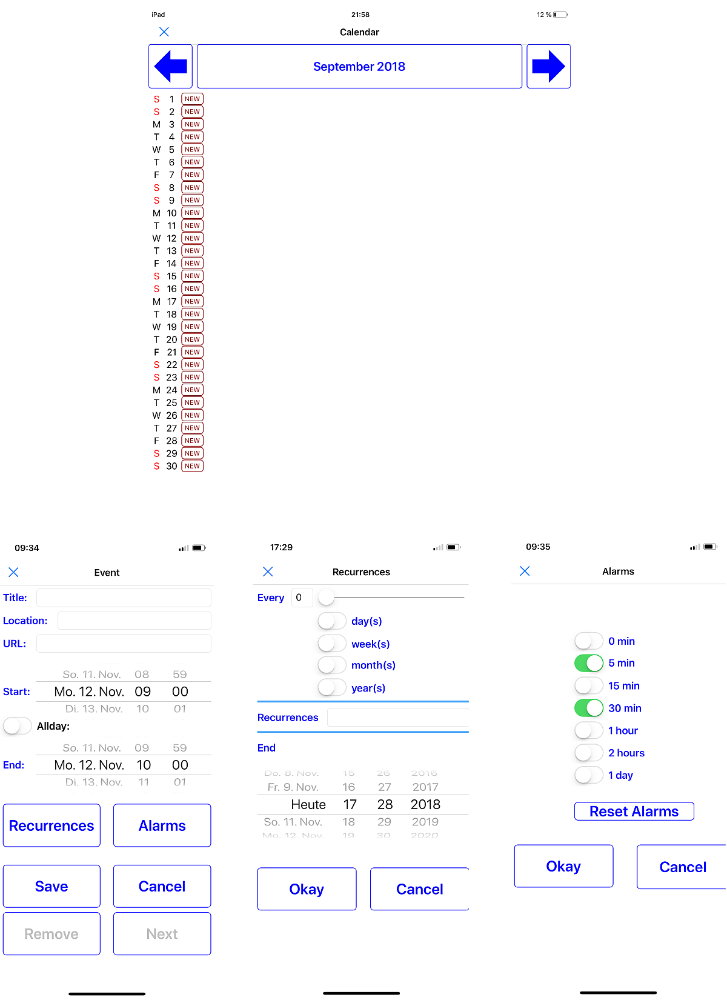

# Calendarapp

Show and edit calendar events (phone layout) 
 
left/right button to change the month 
month/year button to get back to the current month 
 
alarms: 
choose from 0 to 7 alarms 
 
recurrences: 
choose amount of recurrences or an end date 
set every = 0 to delete the recurrences 
if amount is set (e.g. 0 = infinite), the end date is ignored 
 
limitations: 
only predefined alarms can be used
if you edit an alarm or recurrence from another app, all entries (which does not fit in the predefined mask) will be deleted while changing values!!! 
 
Use at your own risk :) 
 

